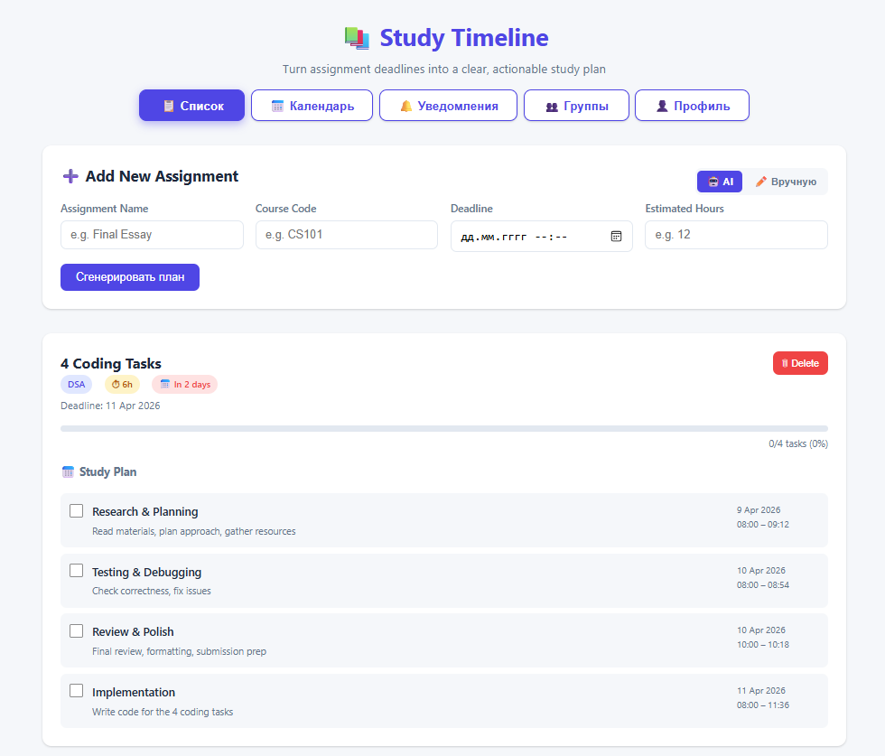
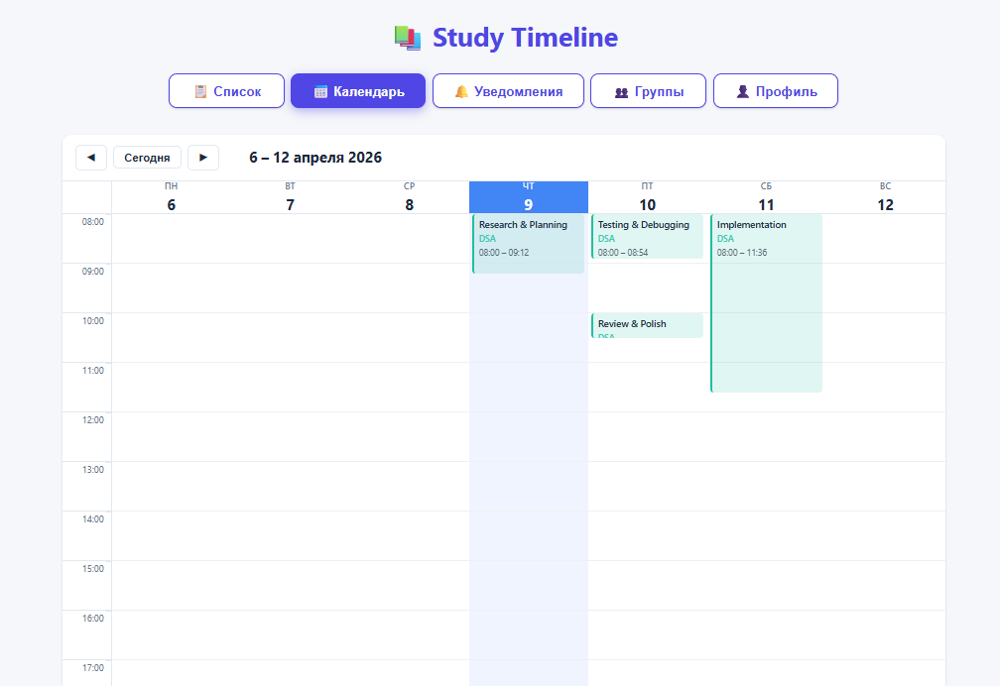
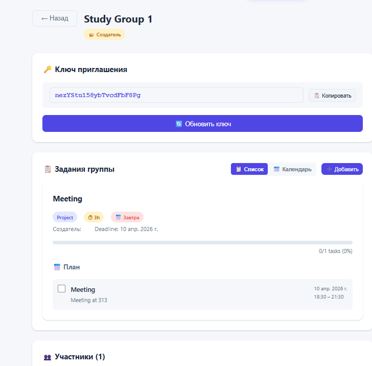
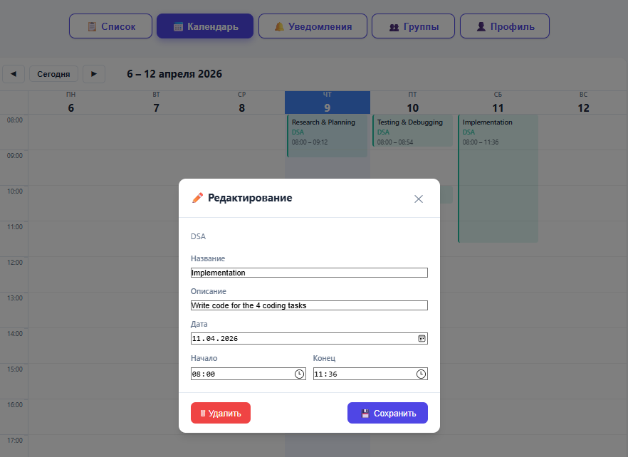

# Study Timeline

A web app that turns raw assignment deadlines into a visual, day-by-day study timeline with automatically generated subtasks and milestone checkpoints.

## Demo


*Assignment list with progress tracking and AI-generated study plans*


*Weekly calendar view with color-coded tasks and drag-and-drop scheduling*


*Group page with shared assignments and invite key management*


*Modal editor for fine-grained task scheduling with time pickers*

## Product Context

### End Users
University students who juggle multiple courses and struggle to plan their study time effectively.

### Problem
Students receive assignment deadlines but have no tool to break them down into actionable daily study targets. Without a clear plan, they either procrastinate or cram at the last minute — leading to lower grades and higher stress.

### Solution
Study Timeline takes an assignment (title, course, deadline, estimated hours), breaks it into 4–6 logical subtasks using AI, and distributes them across the available days before the deadline. The result is a color-coded, day-by-day study plan that students can check off as they go.

## Features

### Implemented ✅
| Feature | Description |
|---|---|
| **Auth** | Registration, login, JWT tokens, profile with avatar |
| **Personal Assignments** | Create via AI (LLM subtask generation) or manually |
| **Weekly Calendar** | Color-coded by course, with hover tooltips showing full task info |
| **Drag & Drop** | Pixel-precise subtask rescheduling (15-min slots) in personal & group calendars |
| **Time Editing** | Native time pickers in a modal for fine-grained start/end time control |
| **Groups** | Create groups, invite via key, roles (Owner / Admin / Member) |
| **Group Assignments** | Shared tasks visible to all members, AI or manual creation |
| **Notifications** | Bell badge with unread count; auto-clears when viewed; filters (personal / group) |
| **Progress Tracking** | Checkboxes, progress bars, completion stats |
| **Responsive Design** | Works on desktop; mobile-friendly layout |

### Not Yet Implemented 🚧
| Feature | Description |
|---|---|
| Real-time notifications | Push notifications / email alerts for upcoming deadlines |
| Calendar sync | Google Calendar / Apple Calendar integration |
| File attachments | Upload reference materials to assignments |
| Recurring tasks | Auto-create weekly tests, lab reports |
| Pomodoro timer | Built-in study session timer |
| Deadline conflict warnings | Alert when multiple deadlines land on the same week |
| Export | CSV / PDF export of study plans |

## Usage

### Prerequisites
- Node.js 18+ (for frontend dev)
- Python 3.11+ (for backend dev)
- Docker & Docker Compose (for production)

### Development

```bash
# Backend
cd backend
python -m venv venv
source venv/bin/activate   # Windows: venv\Scripts\activate
pip install -r requirements.txt
uvicorn main:app --reload

# Frontend (in another terminal)
cd frontend
npm install
npm run dev
```

Backend runs at `http://127.0.0.1:8000`, frontend at `http://localhost:5173`.

### LLM Configuration (optional)

Create `backend/.env` with one of:

```env
# Option 1: Qwen Code API (self-hosted)
LLM_API_BASE_URL=http://<your-ip>:<port>
LLM_API_KEY=<your-key>
LLM_API_MODEL=coder-model

# Option 2: OpenRouter (free tier available)
OPENROUTER_API_KEY=sk-or-xxxxx

# Option 3: DashScope
DASHSCOPE_API_KEY=sk-xxxxx
```

Without an LLM, subtasks are generated algorithmically as a fallback.

## Deployment

### VM Requirements
- **OS:** Ubuntu 24.04 LTS
- **RAM:** 1 GB minimum (2 GB recommended)
- **Disk:** 5 GB free space
- **Docker:** Docker Engine 24+ & Docker Compose v2

### What to Install on the VM

```bash
# Install Docker
curl -fsSL https://get.docker.com | sh
sudo usermod -aG docker $USER
```

### Step-by-Step Deployment

1. **Transfer project files to the VM:**

```bash
# From your local machine (Linux/macOS)
scp project-deploy.tar.gz root@<vm-ip>:/tmp/study-timeline-deploy.tar.gz

ssh root@<vm-ip>
mkdir -p /root/study-timeline-deploy
cd /root/study-timeline-deploy
tar xzf /tmp/study-timeline-deploy.tar.gz
```

2. **Create environment files:**

```bash
# .env.secret (at /root/study-timeline-deploy/.env.secret)
cat > .env.secret << 'EOF'
# LLM API keys (choose one)
OPENROUTER_API_KEY=sk-or-xxxxx
# or
DASHSCOPE_API_KEY=sk-xxxxx
# or
LLM_API_BASE_URL=http://<ip>:<port>
LLM_API_KEY=<key>
LLM_API_MODEL=coder-model

# JWT secret (generate with: python3 -c 'import secrets; print(secrets.token_hex(32))')
SECRET_KEY=<your-random-secret>
EOF

# backend/.env (optional, at /root/study-timeline-deploy/backend/.env)
# Same LLM config as above if not in .env.secret
```

3. **Run the deploy script:**

```bash
cd /root/study-timeline-deploy
bash deploy.sh
```

The script will:
- Build the frontend (Vite production build)
- Rebuild the backend Docker image (`--no-cache`)
- Start both containers

4. **Verify deployment:**

```bash
curl http://localhost:8080/api/health
# Expected: {"status":"ok","timestamp":"..."}
```

5. **Access the app:**

Open `http://<vm-ip>:8080` in a browser. Register a new account and start adding assignments.

### Re-deploying After Code Changes

```bash
# From your local machine
cd study-timeline
tar czf project-deploy.tar.gz \
  --exclude=.git --exclude=node_modules --exclude=dist \
  --exclude=__pycache__ --exclude=*.db --exclude=.env \
  backend/ frontend/ docker-compose.yml nginx.conf deploy.sh

scp project-deploy.tar.gz root@<vm-ip>:/tmp/study-timeline-deploy.tar.gz

ssh root@<vm-ip> "cd /root/study-timeline-deploy && \
  rm -rf backend frontend docker-compose.yml nginx.conf deploy.sh && \
  tar xzf /tmp/study-timeline-deploy.tar.gz && \
  bash deploy.sh"
```
